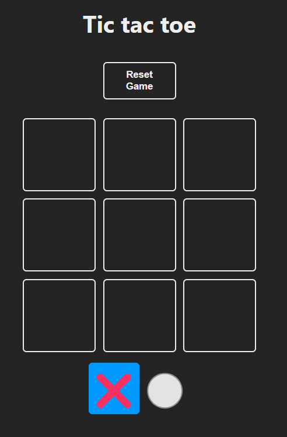
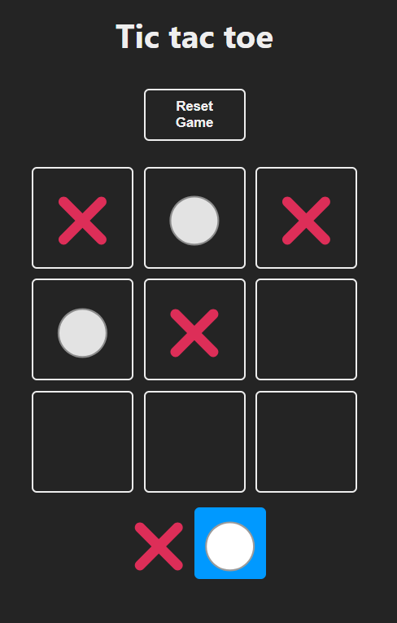
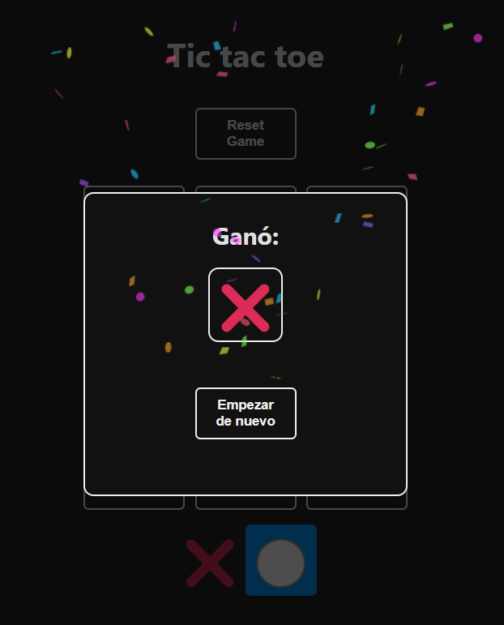

# 2º JUEGO TIC TAC TOE

-Ampliamos el uso del "useState" para aplicarlo en el tablero (board), en el turno y en el ganador

-Guardamos la partida (el turno y el tablero) en el "localStorage"

-Componentizamos las 9 casillas del gtablero y el modal del ganador

-Creamos una logica para saber cuando se ha acabado la partida o cuando hay ganador

  
