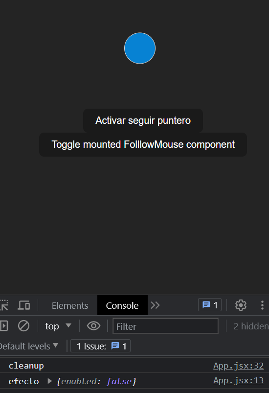

# 3º Seguimineto del puntero

-Usamos el "useEffect" para ejecutar el "handleMove" cuando el estado del "enabled" cambia

-EL "handleMove" recupera las posiciones del puntero y establece dichas coordenas en el estado de la posicion (position)

-Dependiendo del estado del "enable" ejecutamos un listener para el puntero cuando se mueve

-Hacemos que el "useEffect" devuelva un mensaje de limpieza y elimina el listener del puntero

-Creamos un boton dentro del main que renderiza o no el componente "FollowMouse"

   
